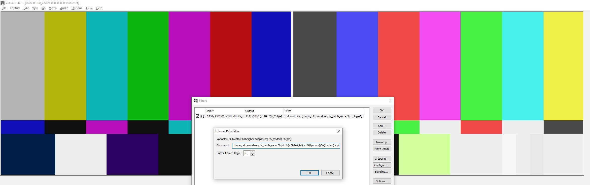

# VirtualDub2 External Pipe Filter

A VirtualDub2 video filter plugin that pipes raw video frames to an external
command's stdin and reads processed frames back from its stdout. This lets you
use any command-line tool (FFmpeg, ImageMagick, custom scripts, etc.) as a
VirtualDub2 filter.



## How it works

Each frame is sent as raw BGRA pixels (top-down, no header) to the external
process via stdin. The process is expected to write back one frame of the same
size and format to stdout for every frame it receives.

## Configuration

- Filter name: "_External pipe_"

- **Command** -- the command line to execute. Placeholders are substituted at
  runtime:
  - `%(width)` -- frame width in pixels
  - `%(height)` -- frame height in pixels
  - `%(fpsnum)` -- frame rate numerator
  - `%(fpsden)` -- frame rate denominator
  - `%(fps)` -- frame rate as a decimal number

- **Buffer frames (lag)** -- if the external command buffers more frames internally
  before producing output (e.g. temporal filters), set this to the number of buffered frames.

  To set this value, increase it until VirtualDub doesn't hang.

  Minimum 1.

- **Command**: use for programs that output 2 frames for every 1 frame in. (Deinterlacers)

## Example: FFmpeg negate filter

```
ffmpeg -f rawvideo -pix_fmt bgra -s %(width)x%(height) -r %(fpsnum)/%(fpsden) -i pipe:0 -vf negate -f rawvideo -pix_fmt bgra pipe:1
```

This works with `lag=1`.

## Example: QTGMC deinterlacing via AviSynth+

See [`qtgmc_pipe.bat`](qtgmc_pipe.bat) and [`qtgmc.avs`](qtgmc.avs).

The pipeline chains three processes:

```
PipeFilter stdin (raw BGRA)
  -> ffmpeg  (convert to YUV4MPEG2 / y4m)
  -> avs2yuv (runs qtgmc.avs; RawSourcePlus reads y4m from stdin, QTGMC processes it)
  -> ffmpeg  (convert y4m back to raw BGRA)
-> PipeFilter stdout
```

In the PipeFilter **Command** field enter the full path to the batch file:

```
"C:\Users\Jonas\Desktop\VirtualDub2-src\VirtualDubPipeFilter\qtgmc_pipe.bat" %(width) %(height) %(fpsnum) %(fpsden)
```

**Requirements:** `ffmpeg` and `avs2yuv` in PATH, AviSynth+ installed, plus the
RawSourcePlus and QTGMC (mvtools2 + havsfunc) plugins. See comments inside
`qtgmc_pipe.bat` for download links.

**Field order:** Edit `qtgmc.avs` and change `AssumeTFF()` to `AssumeBFF()` if
your source is Bottom Field First (SD/NTSC/DV content).

**Frame rate note:** `FPSDivisor=1` makes QTGMC output one progressive frame per field, doubling the frame rate. 
Check "This command doubles framerate" to use this mode. If you use FPSDivisor 2, then leave leave it off.

**Buffer frames (lag)** QTGMC preset "Slower" needs `8`, "Fast" needs `5`.

## Building

Requires CMake and Visual Studio 2022 Build Tools (probably other versions will also work). Edit `build.cmd` to add the right paths for your setup, and then run it.
VirtualDub2 plugins directory.

Download VDPluginSDK-1.2.zip from https://sourceforge.net/p/vdfiltermod/wiki/sdk/ and extract its contents into a directory named VDPluginSDK-1.2 next to the VirtualDubPipeFilter (this repository) directory.

Then run.

```
build.cmd
```
